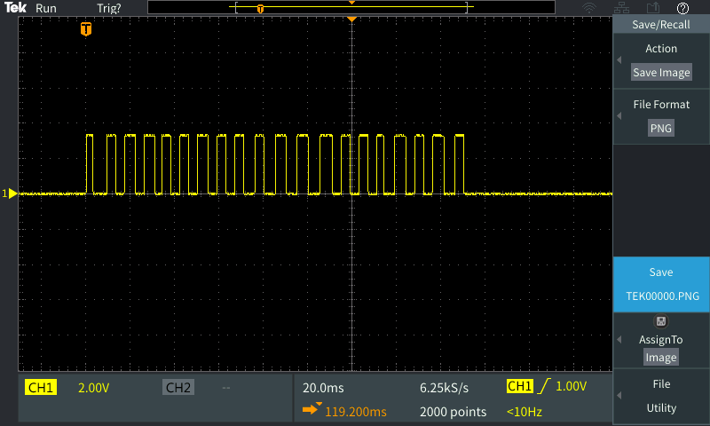
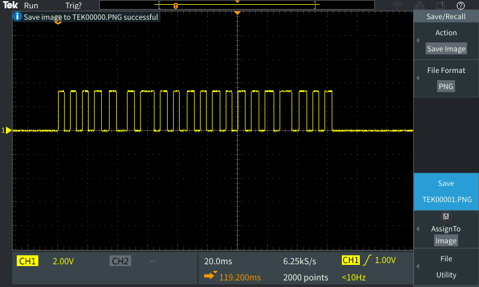
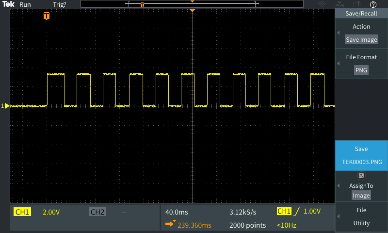
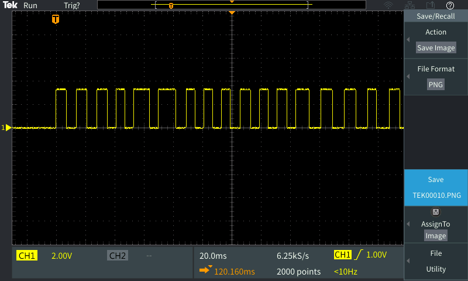
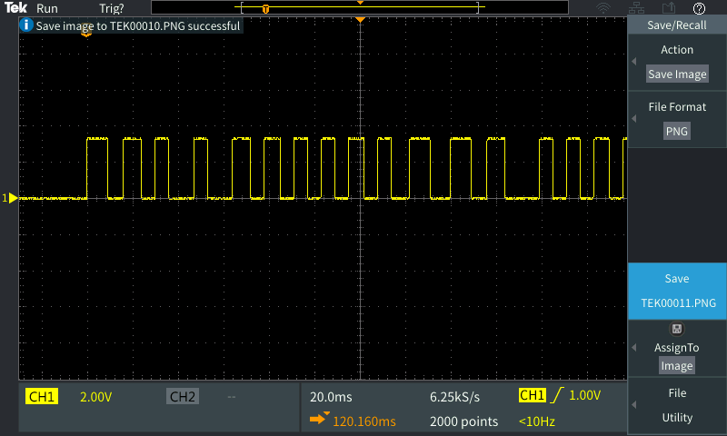
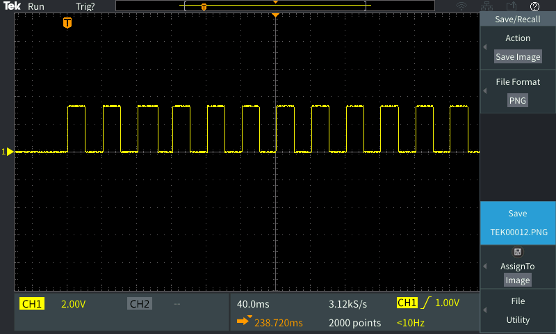
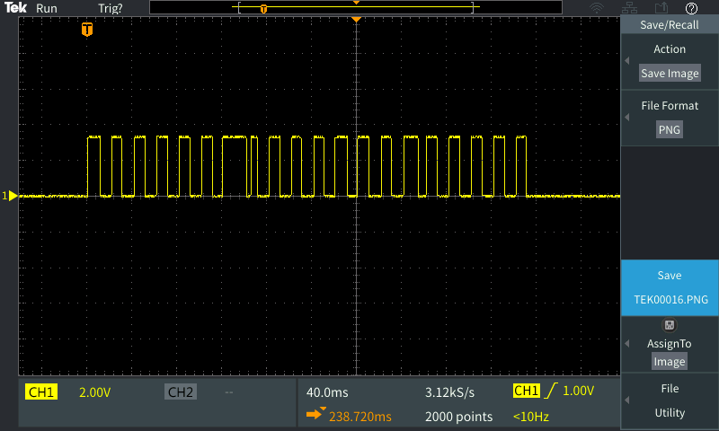
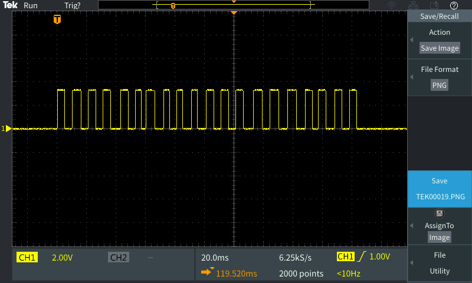

# Android USB Timing Results
Below are the results for two different methods of setting the output state on the Teensy using a USB HID protocol with Interrupt Transfer endpoints.
NOTE: THE PROVIDED CODE DOES NOT NECESSARILY FOLLOW ANY BEST PRACTICIES AND IS SIMPLY JUST ENOUGH TO GET THE TESTS RUNNING STABLY

## Busy Wait
This method sets the state of the pin, and then simply polls the current time until the desired period has elapsed.

```Java
for (int i=0; i<20; i++) {
    bytes[0] = 1;
    connection.bulkTransfer(outendpoint, bytes, bytes.length, timeout);
    myWait(5);
    Log.d(TAG, "Blink");
    bytes[0] = 0;
    connection.bulkTransfer(outendpoint, bytes, bytes.length, timeout);
    myWait(5);
}

...

/* Spin wait */
public void myWait(long msec) {
    long start = System.currentTimeMillis();
    while ((System.currentTimeMillis()-start) < msec) { }
}
```

### No wait (myWait commented out)
With no waiting, the throughput characteristics can be observed.  From this test, it appears that it takes a minimum of about 4 msec to transfer the data.




### 20 Msec wait
With a 20 msec wait, the output is relatively more stable but will still have jitter characteristics that may not be desired.



### 10 Msec wait
With a 10 msec wait, the jitter characteristics are more emphasized.  The output seems relatively consistent, but there are several occasions where the delay is up to 12 msec


### 5 Msec wait
With a 5 msec wait, the jitter characteristics are even more emphasized.  The consistent timing appears to break down around this point, which is expected




## Java Scheduled Task
In an attempt to get better periodic consistency, I tested setting the output using the built in Timer class to schedule a transfer at particular periods

```Java
myTimer.scheduleAtFixedRate(new myBlinkTask(), 0, 20);

...

public class myBlinkTask extends TimerTask {
    @Override
    public void run() {
      if (currCount < maxCount) {
          if (currCount%2 == 1) {
              bytes[0] = 0;
          } else {
              bytes[0] = 1;
          }
          connection.bulkTransfer(outendpoint, bytes, bytes.length, 100);
          currCount++;
      } else {
          Log.d(TAG, "Done Blinking");
          this.cancel();
      }
    }
};
```

### 20 Msec period
With a 20 msec scheduled period, the timing characteristics appear to be very good.  Although there can be up to about 4 msec of latency before the transfer is received, it appears that all of the deadlines are being met.




### 10 Msec period
With a 10 msec scheduled period, the received data appears to be relatively consistent and most deadlines are met with up to about 4 msec of latency, but an occasional deadline is entirely missed. The missed deadlines are not dropped, and instead push back the other operations. Depending on the use case, this may or may not be acceptable.





### 5 Msec period
With a 5 msec scheduled period, most of the deadlines are still met, but deadlines are more frequently entirely missed push back other scheduled transfers.




